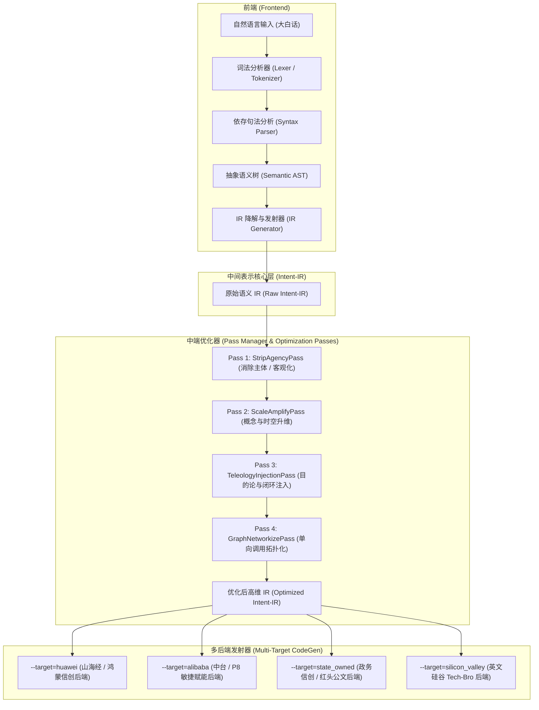

# 001: 基于编译原理的黑话双向编译器架构设计规范 (BSc Architecture Specification)

> **项目代号**：`BSc` (Bullshit Compiler / 语义升维与去魅编译器)  
> **文档版本**：v1.0.0  
> **设计目标**：摒弃传统脆弱的“关键词暴力字典替换”，基于现代工业级编译器（LLVM/GCC）的三段式流水线思想，设计一套独立的**语言无关语义中间表示（Intent-IR）**，通过词法句法解析、中端优化 Pass 流水线、多后端指令选择发射，实现“人类质朴大白话”到“大厂宏大叙事黑话”的结构化编译，并支持反向“脱水去魅反编译”。

---

## 目录
1. [系统整体三段式架构图](#1-系统整体三段式架构图)
2. [前端设计：从自然语言到 Intent-IR](#2-前端设计从自然语言到-intent-ir)
3. [核心灵魂：Intent-IR 规范定义](#3-核心灵魂intent-ir-规范定义)
4. [中端优化器设计：IR 重写 Passes](#4-中端优化器设计ir-重写-passes)
5. [后端生成器设计：多架构代码发射](#5-后端生成器设计多架构代码发射)
6. [反向编译器设计：照妖镜模式](#6-反向编译器设计照妖镜模式)
7. [工程文件结构与后续实施路线图](#7-工程文件结构与后续实施路线图)

---

## 1. 系统整体三段式架构图

本编译器完全对标 LLVM 经典设计，解耦**输入前端**、**核心中间表示（IR）**与**代码发射后端**：



---

## 2. 前端设计：从自然语言到 Intent-IR

前端任务是将含糊的人类日常用语，解析为具备强类型、显式关系、无修饰成分的计算机底层操作。

### 2.1 词法与依存句法分析 (Lexer & AST)
采用轻量级本地分词与句法依存分析器（如分词标注或依存关系解析），提取句子的底层逻辑主干：
* **核心动作谓词 (ROOT)**：例如 `连上`、`发送`、`重启`、`改完`；
* **施动主体 (Subject / nsubj)**：例如 `我`、`团队`；
* **物理介质/通道 (Medium / prep_pobj)**：例如 `蓝牙`、`网线`、`串口`；
* **操作受体/目标实体 (Target / dobj)**：例如 `开发板`、`服务器`、`微服务`；
* **承载负荷 (Payload / obj)**：例如 `照片`、`日志`、`数据包`。

### 2.2 实体分类与类型提升 (Ontology Type Lifting)
前端内置一个**概念分类体系（Ontology Registry）**，对所有抽取的 Token 进行类型提升（Type Lifting）：
* `"蓝牙"` $\to$ `Resource(Domain=RADIO, Sub=BLE, Range=NEAR_FIELD)`
* `"照片"` $\to$ `DataAsset(Form=STATIC, Dimension=UNSTRUCTURED, Medium=VISUAL)`
* `"开发板"` $\to$ `Entity(Kind=HARDWARE_EMBEDDED, Role=EDGE_NODE)`
* `"连上"` $\to$ `Op_Connect()`

---

## 3. 核心灵魂：Intent-IR 规范定义

`Intent-IR` 是语言无关、风格无关的**语义操作指令集**。它类似于静态单赋值形式（SSA），描述纯粹的系统行为。

### 3.1 IR 文本表述规范样例
```llvm
; Module: session_user_intent.ir
; Source Intent: "我用蓝牙把照片传给了开发板，看了一下没问题"

; 声明全局符号与外部资源引用
%agent   = Symbol(Type=HUMAN_OPERATOR, Explicit=True, Scope=LOCAL)
%channel = Resource(Class=PHY_MEDIUM, Protocol=BLE_NEAR_FIELD, Bandwidth=NARROW)
%target  = Node(Class=HW_DEVICE, Arch=ARM_EMBEDDED, Level=EDGE)
%payload = Asset(Type=DATA_BLOB, SubType=IMAGE_STATIC, Dimension=2D)

; 定义语义执行逻辑流
define IntentBlock @Transaction_Pipeline() {
entry:
    ; 指令 1: 建立通道连接
    %session = Op_Connect(%channel, %target)

    ; 指令 2: 资产单向分发
    %tx_status = Op_Dispatch(%payload, Destination=%target, Via=%session)

    ; 指令 3: 状态校验与断言
    %verify_result = Op_AssertState(%target, Condition=STATE_NORMAL)

    ret %verify_result
}
```

### 3.2 基础 IR 操作码指令集 (Opcode Specification)
| 操作码 (Opcode) | 语义定义 | 典型原始输入例词 |
| :--- | :--- | :--- |
| `Op_Connect` | 两个节点建立通道与会话 | 连上、接入、配对、通信 |
| `Op_Dispatch` | 资产/数据在通道上的单向或双向流动 | 发送、传给、上传、同步 |
| `Op_Process` | 对数据资产进行计算、格式转换、存储 | 统计、计算、保存、存盘 |
| `Op_AssertState` | 检查、监控、确认软硬件状态 | 检查、看了下没问题、监控 |
| `Op_Recover` | 异常处理、重启、灾备切换 | 重启、重试、修好了、拉起 |

---

## 4. 中端优化器设计：IR 重写 Passes

原始 IR 虽然规整，但表达过于“实在”、“小巧”。中端优化器（Optimizer）包含一系列独立的 `Pass`，负责对 IR 节点进行**升维重写、句法膨胀与宏大叙事注入**。

### Pass 1: `StripAgencyPass`（去人性化与自主化 Pass）
* **原理**：黑话的一大特征是**隐去具体执行的人**，营造系统底层全自动、自组织、智能运转的宏大感。
* **变换规则**：
  $$\forall \text{Node}(\text{Type} == \text{HUMAN\_OPERATOR}) \implies \text{Purge}(\text{Node})$$
  将操作的主导权由人类 `%agent` 转移至系统内核或网络层本身。

### Pass 2: `ScaleAmplifyPass`（概念升维与时空膨胀 Pass）
* **原理**：将单点、局部的物理概念，提升为生态化、架构级的概念：
  * `BLE_NEAR_FIELD` $\to$ `DISTRIBUTED_HETEROGENEOUS_SOFTBUS`（全场景近场分布式软总线）；
  * `IMAGE_STATIC` $\to$ `HIGH_DIMENSIONAL_NON_STRUCTURED_DATA_ASSET`（高维非结构化数据资产）；
  * `HW_DEVICE` $\to$ `EDGE_INTELLIGENT_COMPUTE_TERMINAL`（端侧智能计算节点）。

### Pass 3: `GraphNetworkizePass`（单向动作拓扑化 Pass）
* **原理**：将孤立的点对点单向操作（A 传给 B），重写为多维网状协同关系：
  * `Op_Connect` 升维为 `Op_BuildTopologicalFederation`（构建多端协同动态拓扑联邦）。

### Pass 4: `TeleologyInjectionPass`（目的论与价值闭环注入 Pass）
* **原理**：任何普通操作在汇报时必须具备“战略意义”和“闭环结果”。
* **变换规则**：在 `IntentBlock` 结尾追加插入虚拟价值指令：
  * 自动追加 `Op_CloseValueLoop(Objective=ENABLE_CORE_BUSINESS, Metric=HIGH_AVAILABILITY)`。

---

## 5. 后端生成器设计：多架构代码发射

同一份经 Pass 优化后的 `Optimized Intent-IR`，交由不同的目标后端（Target Backend），发射出截然不同风格的终端黑话：

### 5.1 `--target=huawei` (华为山海经 / 军工信创后端)
* **指令模式匹配映射**：
  * `Op_Connect` $\to$ *“拉通全场景近场分布式软总线底座”*
  * `Op_Dispatch` $\to$ *“实现原子化高维多媒体流转拓扑协同”*
  * `Op_AssertState` $\to$ *“全面筑牢端侧自主可控安全基线”*
* **发射产物**：
  > “依托全场景近场分布式软总线底座，打破端侧物理交互边界，实现高维非结构化多媒体资产向端侧边缘异构节点的毫秒级原子化流转，全面筑牢端云协同的自主可控验证基线。”

### 5.2 `--target=alibaba` (阿里中台 / P8 敏捷赋能后端)
* **指令模式匹配映射**：
  * `Op_Connect` $\to$ *“以低功耗通信底座为核心抓手”*
  * `Op_Dispatch` $\to$ *“打通端到端资产流转交付链路”*
  * `Op_CloseValueLoop` $\to$ *“形成高可用验证闭环，持续赋能业务心智”*
* **发射产物**：
  > “以端侧异构硬件为底层抓手，深度解耦物理边界，打通高维非结构化数据资产跨域流转全链路，沉淀高可用交付闭环，持续赋能端侧业务心智。”

### 5.3 `--target=state_owned` (政企信创 / 政策红头后端)
* **指令模式匹配映射**：
  * 强调“高位谋划、多措并举、坚守底线、一体化推进”。
* **发射产物**：
  > “围绕端侧数字化转型总体布局，统筹推进近场通信基础设施建设，多措并举深化数据要素高水平互联互通，切实防范系统性运行风险，筑牢新质生产力安全发展基石。”

### 5.4 `--target=silicon_valley` (硅谷英文 Tech-Bro 后端)
* **指令模式匹配映射**：
  * 强调 "Leverage, Zero-trust, Fabric, Streamline, Paradigm shift, End-to-end".
* **发射产物**：
  > "Leveraging an edge-native zero-trust wireless fabric to orchestrate seamless ingestion of high-dimensional unstructured visual payloads, closing the observability loop across heterogeneous IoT runtimes."

---

## 6. 反向编译器设计：照妖镜模式 (Decompiler)

除了从人话生成黑话，本架构天生支持**反向编译（Decompilation / De-jargonizing）**：


* **反编译案例**：
  * **输入**：*“依托全栈能力布局，兼具业务灵活性与敏捷交付，通过多线程并行推进技术架构自研”*
  * **IR 还原**：`Project(Budget=LOW, TeamSize=MINIMAL, Roles=[FULLSTACK, QA, DEVOPS])`
  * **大白话输出**：*“【残酷真相】：我们没钱招专职团队，想用 5000 块招个全干杂工把前后端测试运维全包了。”*

---

## 7. 工程文件结构与后续实施路线图

### 7.1 项目物理文件目录结构
```text
/home/deck/Games/agy/bsc/
├── docs/
│   └── 001_compiler_architecture_design.md   # 本架构设计规范
├── src/
│   ├── frontend/                              # 前端：词法/句法解析与 IR 生成
│   │   ├── __init__.py
│   │   ├── lexer.py                           # 实体与动作 Token 抽取
│   │   └── ir_builder.py                      # 构建未优化的 Intent-IR
│   ├── ir/                                    # 核心中间表示定义
│   │   ├── __init__.py
│   │   ├── instructions.py                    # Opcode 指令类定义
│   │   ├── types.py                           # 实体/介质/资产类型系统
│   │   └── module.py                          # IR 模块与基本块容器
│   ├── optimizer/                             # 中端优化器与 Passes
│   │   ├── __init__.py
│   │   ├── pass_manager.py                    # 优化流水线调度器
│   │   ├── strip_agency.py                    # Pass 1: 去人性化
│   │   ├── scale_amplify.py                   # Pass 2: 概念升维
│   │   └── teleology_inject.py                # Pass 3: 目的论闭环注入
│   ├── backend/                               # 后端代码生成器
│   │   ├── __init__.py
│   │   ├── emitter_base.py                    # 代码发射基类与模式匹配器
│   │   ├── targets/
│   │   │   ├── huawei.py                      # 华为山海经后端
│   │   │   ├── alibaba.py                     # 阿里 P8 抓手后端
│   │   │   ├── state_owned.py                 # 国企政务信创后端
│   │   │   └── silicon_valley.py              # 硅谷英文后端
│   └── decompiler/                            # 反向去魅反编译器
│       ├── __init__.py
│       └── truth_extractor.py                 # 照妖镜提取器
├── tests/                                     # 单元测试与端到端测试用例
│   ├── test_frontend.py
│   ├── test_ir_passes.py
│   └── test_codegen.py
├── cli.py                                     # 命令行入口 (bsc --target=...)
└── README.md                                  # 项目启动说明
```

### 7.2 实施三步走计划
1. **Milestone 1 (极简骨架)**：实现 `ir/` 基础指令数据结构与 `backend/huawei.py` 简单发射器，打通从手动构建 IR 到发射黑话的链路；
2. **Milestone 2 (前端与 Pass 管道)**：实现 `frontend/` 基于模式匹配抽取自然语言并自动构建 IR，接入 `PassManager` 运行 3 个核心膨胀 Pass；
3. **Milestone 3 (多后端与照妖镜反编译)**：完善 `--target=alibaba`、`--target=state_owned`，并实现反向解构离谱 JD 的反编译功能。
