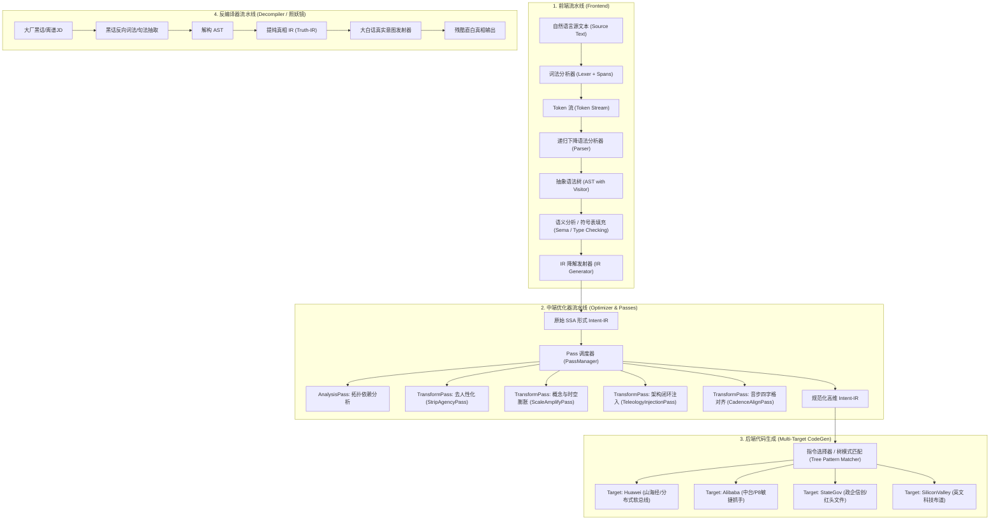
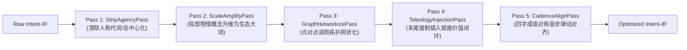

# 002: 大型跨平台黑话编译器与交互式 Web Explorer 系统架构规范

> **工程全称**：`Bullshit Compiler`（大厂黑话语义升维与去魅编译器，工程目录名：`bullshit-compiler`）  
> **文档编号**：`DOC-002`  
> **状态**：架构方案讨论与设计准则（正式稿）  
> **定位目标**：拒绝简单脚本玩具，完全遵循现代工业级编译器（LLVM / Rustc）的经典理论，建立一套**严谨形式文法（EBNF）、抽象语法树（AST）、静态单赋值（SSA）语义中间表示（Intent-IR）、中端 Pass 优化流水线、多后端指令选择发射**的完整大型编译工程。并通过**现代化跨平台架构与 Web Compiler Explorer（类似 Godbolt）**向用户全景可视化展示编译管线。

---

## 目录
1. [项目全称与工程级愿景](#1-项目全称与工程级愿景)
2. [编译理论严格映射规范](#2-编译理论严格映射规范)
3. [核心技术选型与跨平台设计](#3-核心技术选型与跨平台设计)
4. [核心编译管道深度设计 (Pipeline In-Depth)](#4-核心编译管道深度设计-pipeline-in-depth)
   - 4.1 形式文法定义 (Formal Grammar / EBNF)
   - 4.2 词法解析 (Lexer) 与源码位置映射 (Source Spans)
   - 4.3 语法分析 (Parser) 与抽象语法树 (AST)
   - 4.4 符号表与语义类型系统 (Symbol Table & Semantic Types)
   - 4.5 语言无关的 SSA 形式中间表示 (Intent-IR Specification)
   - 4.6 中端优化器与 Pass 流水线 (PassManager & Pass Graph)
   - 4.7 目标代码生成与指令选择 (Backend Emitters & Pattern Matching)
   - 4.8 工业级反编译引擎 (Decompiler / Reverse Pipeline)
5. [跨平台交互式 Web 展示架构 (Compiler Explorer)](#5-跨平台交互式-web-展示架构-compiler-explorer)
6. [工程目录组织规范与模块划分](#6-工程目录组织规范与模块划分)
7. [演进路线图与阶段性交付件](#7-演进路线图与阶段性交付件)

---

## 1. 项目全称与工程级愿景

### 1.1 命名规范与概念界定
* **工程全称**：`Bullshit Compiler System`（跨平台语义升维与去魅编译器系统）
* **目录全称**：`/home/deck/Games/agy/bullshit-compiler/`
* **命令行二进制名**：`bsc`（作为官方 CLI 命令）
* **定位**：这是一套以计算机编译原理为根基、兼具工业级软件架构深度与讽刺解压文化价值的跨平台系统。它不仅是一个文本处理工具，更是**一套可运行、可可视化、可剖析的编译原理全流程演示教学工程**。

---

## 2. 编译理论严格映射规范

本工程杜绝一切地摊式的字符串正则替换，从输入到输出严格遵守传统经典编译器流水线：



---

## 3. 核心技术选型与跨平台设计

为了满足用户提出的“**跨平台运行**”且“**用 Web 方式交互展示效果**”的核心诉求，系统技术栈选型如下：

### 3.1 跨平台技术栈组合

| 层次 | 推荐方案 | 备选方案 | 选型理由 |
| :--- | :--- | :--- | :--- |
| **编译器核心核心库** | **Rust** | **Python (类型注解 + C 扩展)** | Rust 具备绝对的内存安全、零成本抽象、无 GC 停顿，且**能直接编译为 WebAssembly (WASM)**，实现纯客户端零服务端在浏览器运行；Python 适合极速原型迭代。 |
| **Web 前端展示** | **Vue 3 + TypeScript + Vite + TailwindCSS** | **React + Monaco Editor** | 响应式极佳、打包轻量，配合 Monaco Editor（VS Code 核心）打造类似 Godbolt 的多栏分屏联动交互。 |
| **GUI / 客户端形态** | **PWA (渐进式 Web 应用) + 单二进制 CLI 内置 Web Server** | **Tauri (Rust + Webview)** | 无论在 Linux (Steam Deck)、macOS (Mac Studio)、Windows 还是 iPad 上，只需运行一次本地二进制或直接打开浏览器即可完整使用，完全免安装复杂环境。 |

### 3.2 跨平台交付形态
1. **统一单文件二进制 CLI (`bsc`)**：
   * 支持通过交叉编译直接输出 `bsc-linux-x86_64`、`bsc-linux-aarch64`、`bsc-macos-arm64`、`bsc-windows-x64.exe`；
   * 命令行支持：`bsc compile --target=huawei "输入文本"`；
   * 一键启动服务模式：`bsc serve --port 8080`，自动拉起本地 Web 控制台并在浏览器中打开。
2. **纯前端 WASM 离线运行模式**：
   * 将核心编译逻辑直接编译成 WebAssembly 模块，iPad 用户只需打开网页，不依赖本地服务器也能在浏览器沙盒内直接运行编译器。

---

## 4. 核心编译管道深度设计 (Pipeline In-Depth)

### 4.1 形式文法定义 (Formal Grammar / EBNF)

我们为人类质朴意图语言形式化定义一套微型上下文无关文法（CFG），使用扩展巴科斯范式（EBNF）描述：

```ebnf
IntentProgram   ::= Statement* EOF ;
Statement       ::= [TemporalClause] [AgentClause] ActionPhrase [TerminalClause] ;

TemporalClause  ::= "昨天" | "今天" | "刚才" | "在" TimeExpr ;
AgentClause     ::= Pronoun | "团队" | "大家" ;
Pronoun         ::= "我" | "我们" | "他" | "他们" ;

ActionPhrase    ::= [PrepPhrase] VerbPhrase ;
PrepPhrase      ::= ("用" | "通过" | "基于") Medium ;
Medium          ::= "蓝牙" | "网线" | "串口" | "WiFi" | Identifier ;

VerbPhrase      ::= TransitiveVerb ObjectPhrase 
                  | IntransitiveVerb ;

TransitiveVerb  ::= "连上" | "发送" | "传输" | "保存" | "修改" | "排查" ;
IntransitiveVerb::= "重启" | "崩溃" | "恢复" ;

ObjectPhrase    ::= [TargetModifier] TargetEntity [DataPayload] ;
TargetEntity    ::= "开发板" | "服务器" | "电脑" | "数据库" | Identifier ;
DataPayload     ::= "照片" | "文件" | "日志" | "代码" | Identifier ;

TerminalClause  ::= [OutcomeAssertion] ;
OutcomeAssertion::= "看了一下没问题" | "成功了" | "挂掉了" | "修好了" ;
```

### 4.2 词法解析 (Lexer) 与源码映射 (Source Spans)
每一个 Token 都必须携带精准的源码位置元数据（`Span`），以便在 Web 端实现类似 IDE 的**高亮追溯与鼠标悬停语法分析**：

```rust
pub struct Span {
    pub start_line: usize,
    pub start_col: usize,
    pub end_line: usize,
    pub end_col: usize,
}

pub enum TokenKind {
    Identifier(String),
    KeywordAgent(String),      // "我", "团队"
    KeywordPrep(String),       // "用", "基于"
    KeywordVerb(String),       // "连上", "发送"
    KeywordOutcome(String),    // "看了一下没问题"
    LiteralString(String),
    EOF,
}

pub struct Token {
    pub kind: TokenKind,
    pub span: Span,
    pub raw_text: String,
}
```

### 4.3 语法分析 (Parser) 与抽象语法树 (AST)
采用**递归下降（Recursive Descent）结合 Pratt Parsing** 算符优先级算法构建 AST。设计遵循访问者模式（Visitor Pattern）：

```rust
// AST 节点定义核心示意
pub enum ASTStatement {
    OperationStmt(Box<OperationNode>),
    EventStmt(Box<EventNode>),
}

pub struct OperationNode {
    pub agent: Option<AgentNode>,       // 施动者
    pub medium: Option<MediumNode>,     // 通信介质
    pub action: ActionNode,             // 核心动作
    pub target: Option<TargetNode>,     // 目标硬件/系统
    pub payload: Option<PayloadNode>,   // 数据载荷
    pub outcome: Option<OutcomeNode>,   // 结束断言
    pub span: Span,
}

// 统一的 AST 遍历访问者特征 (Visitor Pattern)
pub trait ASTVisitor<T> {
    fn visit_statement(&mut self, stmt: &ASTStatement) -> T;
    fn visit_operation(&mut self, op: &OperationNode) -> T;
    fn visit_action(&mut self, action: &ActionNode) -> T;
}
```

### 4.4 符号表与语义类型系统 (Symbol Table & Semantic Types)
在编译器的语义分析阶段（Sema），将原始 AST 的具体名词绑定至强类型符号表与**领域本体体系（Domain Ontology）**中：

* **实体类型（EntityType）**：
  * `HW_EMBEDDED_DEVICE`：开发板、单片机、工控机；
  * `INFRA_SERVER_CLUSTER`：服务器、集群、中心节点；
  * `COMM_PHY_MEDIUM`：蓝牙、串口、网线、WiFi；
  * `DATA_ASSET_BLOB`：照片、视频、二进制流、配置文件。
* **动作语义类型（ActionSemantics）**：
  * `TOPOLOGY_BIND`：建立连接、握手、附着；
  * `PIPELINE_DISPATCH`：发送、推流、广播、投递；
  * `LIFECYCLE_MUTATE`：重启、热更新、冷启动、熔断。

### 4.5 语言无关的 SSA 形式中间表示 (Intent-IR Specification)
`Intent-IR` 是解耦前端自然语言与后端目标方言的核心中枢。它具备静态单赋值（SSA）特性，拥有显式的类型声明和基本块（BasicBlock）组织：

```llvm
; ==============================================================================
; Module: session_user_intent.ir
; Source Intent: "昨天我用蓝牙把照片传给了开发板，看了一下没问题"
; Target-Independent Semantic SSA Form
; ==============================================================================

target triple = "semantic-intent-generic-v1"

; 全局实体与拓扑节点声明
%node.operator = sym @human_agent(role=OPERATOR, implicit=true)
%node.medium   = resource @comm_channel(domain=RADIO_RF, proto=BLE, mode=NEAR_FIELD)
%node.target   = entity @edge_terminal(kind=EMBEDDED_SOC, role=DEVICE_NODE)
%data.payload  = asset @unstructured_blob(type=STATIC_IMAGE, dim=TWO_DIMENSIONAL)

define void @main_pipeline() {
entry:
    ; Instruction 1: 会话建立
    %0 = Op_EstablishSession (%node.medium, %node.target) -> !SessionHandle
    
    ; Instruction 2: 资产单向分发
    %1 = Op_TransferPayload (%data.payload, to: %node.target, channel: %0) -> !TransferResult
    
    ; Instruction 3: 状态断言确认
    %2 = Op_AssertIntegrity (%node.target, expect: STATUS_OK) -> !HealthReport
    
    ; 终结指令
    ret %2
}
```

### 4.6 中端优化器与 Pass 流水线 (PassManager & Pass Graph)
中端是本项目的精髓所在，也是编译理论教学的最直观展现。我们实现一个工业级的 `PassManager`，支持 Passes 的注册、依赖检查、执行与 IR 状态回滚。



#### Pass 深度实现规范：
1. **`StripAgencyPass`（去人性化 Pass）**：
   * 遍历基本块内的指令参数，若操作依赖于 `HUMAN_OPERATOR`，将其置空，重写指令的操作模式为 `AUTONOMOUS_DAEMON`；
2. **`ScaleAmplifyPass`（概念升维 Pass）**：
   * 遍历符号表与资源声明：
     * `BLE` $\to$ `ABSTR_DSOFTBUS_FABRIC`；
     * `STATIC_IMAGE` $\to$ `ABSTR_MULTIMODAL_ASSET`；
     * `EMBEDDED_SOC` $\to$ `ABSTR_EDGE_HETEROGENEOUS_NODE`；
3. **`TeleologyInjectionPass`（目的论闭环 Pass）**：
   * 分析 CFG 控制流图的出口基本块，在 `ret` 指令前注入合成指令：
     ```llvm
     %loop_val = Op_SynthesizeValueLoop(domain=STRATEGIC_EMPOWERMENT, cadence=CLOSED_LOOP)
     ```

### 4.7 目标代码生成与指令选择 (Backend Emitters & Pattern Matching)
后端采用基于**最大吞吐树模式匹配（Maximal Munch Pattern Matching）**算法，为不同的目标受众生成风格迥异的黑话汇编：

* **Huawei Target (`--target=huawei`)**：
  * `Op_EstablishSession` $\to$ 匹配规则：*“依托全场景近场分布式软总线底座”*；
  * `Op_TransferPayload` $\to$ 匹配规则：*“实现非结构化数据资产在异构边缘算力节点的原子化流转”*；
  * `Op_AssertIntegrity` $\to$ 匹配规则：*“全面筑牢端云协同的自主可控基线”*。
* **Alibaba Target (`--target=alibaba`)**：
  * 强匹配：“底层抓手”、“打通端到端链路”、“沉淀心智与复用能力”、“形成敏捷业务飞轮”。
* **StateGov Target (`--target=state_owned`)**：
  * 强匹配：“提高政治站位”、“坚持一体化统筹谋划”、“多措并举推进数字底座高水平安全”。
* **Silicon Valley Target (`--target=silicon_valley`)**：
  * 强匹配：“Leverage next-gen zero-trust edge fabrics to democratize real-time ingestion of unstructured assets at scale.”

### 4.8 工业级反编译引擎 (Decompiler / 照妖镜模式)
反编译器是前向编译的逆向镜像：
1. **模式反识别（De-Patternizer）**：利用正则与语义指纹匹配去除“赋能”、“底座”、“抓手”等虚假修辞，提取核心有效谓词与对象；
2. **IR 提纯（Truth Extraction）**：还原出最精简的 `Truth-IR`；
3. **大白话生成（Plain Truth Emitter）**：用最无情、最刻薄的大白话输出客观真相。

---

## 5. 跨平台交互式 Web 展示架构 (Compiler Explorer)

为了实现“**应用 Web 方式展示效果**”，系统将提供类似 **Compiler Explorer (Godbolt)** 的多窗口高响应式界面：

```
+-------------------------------------------------------------------------------------------------------+
|  Bullshit Compiler Explorer (v1.0.0)             [Target: Huawei 鸿蒙/山海经 ▼] [Optimization: -O3 ▼]  |
+-----------------------------------+-----------------------------------+-------------------------------+
|  Pane 1: 原始输入 (Source Input)    |  Pane 2: 中间表示 (Intent-IR)       |  Pane 3: 目标发射 (Generated)   |
+-----------------------------------+-----------------------------------+-------------------------------+
| 1 | 我用蓝牙把照片传给了开发板，      | 1 | define void @pipeline() {         | 依托全场景近场分布式软总线底座， |
| 2 | 看了一下没问题。                | 2 |   %0 = Op_EstablishSession(...)   | 打破端侧物理边界，实现高维非结  |
|   |                               | 3 |   %1 = Op_TransferPayload(...)    | 构化数据资产在端侧异构边缘节点  |
|   |                               | 4 |   %2 = Op_AssertIntegrity(...)    | 上的原子化平滑流转，全面筑牢端  |
|   |                               | 5 |   ret %2                          | 云协同的自主可控验证闭环！     |
|   |                               | 6 | }                                 |                               |
+-----------------------------------+-----------------------------------+-------------------------------+
|  Pane 4: AST 与 Pass 运行诊断监视器 (AST & Pass Pipeline Inspector)                                      |
+-------------------------------------------------------------------------------------------------------+
|  [AST Tree View]              [Pass: StripAgency]  -->  [Pass: ScaleAmplify]  -->  [Pass: TeleologyLoop]  |
|  └── OperationNode (Connect)  | [IR diff: -%agent] |    | [BLE -> DSoftBus] |  | [+Op_SynthesizeLoop]     |
+-------------------------------------------------------------------------------------------------------+
```

### Web 架构核心特性：
1. **联动高亮（Cross-Highlighting）**：鼠标在左侧选中“蓝牙”，中间的 `%node.medium` 和右侧的“全场景近场分布式软总线”**三栏同步高亮**，直观展现编译对应关系；
2. **Pass 单步调试步进器（Pass Stepper）**：用户可以点击任意一个 Pass，实时查看该 Pass 前后 IR 的 `Diff` 变化，亲身体会编译优化的魅力；
3. **照妖镜反编译一键切换**：点击顶部切换为“反编译模式”，粘贴招聘 JD 或公文，右侧瞬间输出残酷真相。

---

## 6. 工程目录组织规范与模块划分

```text
/home/deck/Games/agy/bullshit-compiler/
├── docs/                                          # 设计与架构文档
│   ├── 001_compiler_architecture_design.md        # 001 初始概念论证
│   └── 002_large_scale_cross_platform_compiler_and_web_architecture.md # 本规范文件
├── crates/                                        # 核心模块代码 (采用多包 Monorepo 规范)
│   ├── bsc-core/                                  # 核心数据结构与抽象特征
│   │   ├── src/
│   │   │   ├── span.rs                            # 源码位置映射与 Diagnostics
│   │   │   ├── ast.rs                             # 抽象语法树节点与 Visitor
│   │   │   ├── ir.rs                              # Intent-IR SSA 结构体定义
│   │   │   └── error.rs                           # 统一编译报错体系
│   ├── bsc-frontend/                              # 编译前端
│   │   ├── src/
│   │   │   ├── lexer.rs                           # 词法切分与 Token 生成
│   │   │   ├── parser.rs                          # 递归下降语法分析器
│   │   │   ├── sema.rs                            # 符号解析与类型系统
│   │   │   └── ir_builder.rs                      # AST 到 Intent-IR 降解发射
│   ├── bsc-opt/                                   # 中端优化器
│   │   ├── src/
│   │   │   ├── pass.rs                            # Pass 与 PassManager 特征抽象
│   │   │   ├── strip_agency.rs                    # 去人性化 Pass
│   │   │   ├── scale_amplify.rs                   # 概念升维 Pass
│   │   │   ├── cadence_align.rs                   # 音步节奏对齐 Pass
│   │   │   └── teleology_inject.rs                # 价值闭环注入 Pass
│   ├── bsc-backend/                               # 后端代码发射器
│   │   ├── src/
│   │   │   ├── isel.rs                            # 树模式匹配与指令选择
│   │   │   ├── huawei.rs                          # 华为山海经发射器
│   │   │   ├── alibaba.rs                         # 阿里 P8 抓手发射器
│   │   │   ├── state_owned.rs                     # 政企信创公文发射器
│   │   │   └── silicon_valley.rs                  # 硅谷英文科技发射器
│   ├── bsc-decompiler/                            # 反向去魅反编译器
│   │   ├── src/
│   │   │   ├── de_pattern.rs                      # 黑话指纹识别
│   │   │   └── truth_emitter.rs                   # 大白话意图输出
│   ├── bsc-cli/                                   # 跨平台 CLI 二进制工程
│   │   ├── src/
│   │   │   └── main.rs                            # 命令行交互与本地服务入口
│   └── bsc-wasm/                                  # WebAssembly 包装层
│       ├── src/
│       │   └── lib.rs                             # 导出至前端 JS/TS 的编译函数
├── web/                                           # 交互式 Web Explorer (Compiler Explorer 前端)
│   ├── package.json
│   ├── vite.config.ts
│   ├── src/
│   │   ├── components/
│   │   │   ├── MonacoEditor.vue                   # 源码与 IR 高亮编辑器
│   │   │   ├── ASTVisualizer.vue                  # 语法树可视化节点图
│   │   │   ├── PassDiffViewer.vue                 # 优化 Pass 前后对比组件
│   │   │   └── TargetSelector.vue                 # 后端架构切换选择器
│   │   ├── App.vue
│   │   └── main.ts
├── tests/                                         # 严格集成测试与基准测试
│   ├── e2e_compiler_tests.rs
│   └── pass_pipeline_tests.rs
├── Cargo.toml                                     # 工作区配置
└── Makefile                                       # 跨平台一键构建脚本
```

---

## 7. 演进路线图与阶段性交付件

* **阶段 1 (Phase 1: 核心内核原型验证)**：
  * 构建 `bsc-core` 与 `bsc-frontend`，实现输入白话句子后能够生成规范的 `Intent-IR` 文本并能格式化打印（Dump IR）。
* **阶段 2 (Phase 2: PassManager 与双后端打通)**：
  * 构建中端优化流水线，跑通 3 个关键 Pass；
  * 跑通 `--target=huawei` 与 `--target=alibaba` 代码发射，实现端到端命令行编译。
* **阶段 3 (Phase 3: Web Compiler Explorer 交互界面落地)**：
  * 搭建 Web 端交互工程，打通 Monaco Editor 与 WASM 编译内核，呈现多栏实时联动与 Pass 步进视图；
* **阶段 4 (Phase 4: 照妖镜反编译器与多平台打包发布)**：
  * 实现大厂黑话与离谱 JD 的反编译解构；
  * 交叉编译 Linux (Steam Deck)、macOS (Mac Studio)、Windows 二进制发布包。
