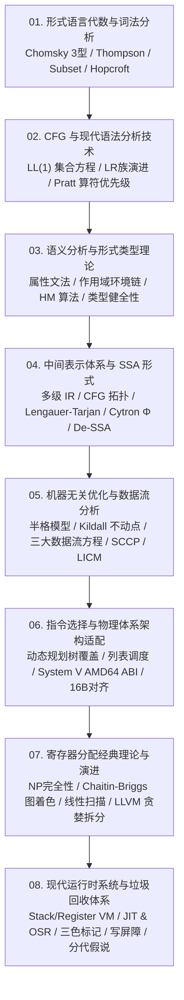

# 012: 编译原理大百科知识全景体系与 Rust 跨平台原生应用架构

> **状态**: 已规划并在 Web 交互端与原生跨平台终端（TUI）全面落地  
> **学术基准**: Aho, Lam, Sethi, Ullman《Compilers: Principles, Techniques, and Tools》(龙书) / Cooper & Torczon《Engineering a Compiler》(工程编译器) / Appel《Modern Compiler Implementation》(虎书) / Pierce《Types and Programming Languages》(TAPL)  
> **工程对照**: LLVM 18+ 代码优化管线、Rustc 借用检查与 MIR 系统、V8 字节码解释与分层 JIT 编译体系  
> **核心使命**: 彻底跳过玩具式代码案例，全面聚焦教材级数学推导、状态机算法与工程实现对比；打破“Rust 仅作为 WebAssembly 从属脚本”的狭隘定位，建立“WebAssembly + 原生命令行 (CLI) + 原生跨平台终端工作台 (TUI)”三位一体的系统级跨平台矩阵。

---

## 一、项目在“编译原理”方面的完整度评估与重构动因

### 1. 原有架构的断层与局限（35% ~ 40% 完整度）
在早期版本中，项目虽然完成了微型命令式语言的基础编译流水线（Lexer &rarr; Parser &rarr; Type &rarr; 3AC &rarr; Bytecode &rarr; VM），但在**理论完整度**与**工程形态**上存在显著短板：
1. **理论知识展示浅表化**：原界面虽然划分了 6 个阶段，但每个阶段仅有三四百字浅层概述，充斥着占位式交互小组件，缺乏形式化数学定义、状态转移矩阵、算法伪代码与定理证明；
2. **工业级核心算法缺失**：缺乏 Chomsky 3 型文法正规代数、Hopcroft DFA 最小化、LL(1) FIRST/FOLLOW/SELECT 形式化推导方程组、LR 族同心集合并冲突根源、Hindley-Milner 类型推导 Algorithm W、Milner 类型健全性定理（Progress + Preservation）、支配树 Lengauer-Tarjan 算法、Cytron SSA 支配边界算法、Kildall 半格不动点迭代、Chaitin-Briggs 图着色寄存器分配、System V AMD64 ABI 栈帧规范、以及 GC 三色标记与写屏障；
3. **Rust 系统级能力被禁锢**：仅把 Rust 当作编译出 `.wasm` 二进制并在浏览器中调用的辅助计算模块，忽略了 Rust 在高性能跨平台原生桌面/终端应用中的系统级优势。

### 2. 重构与扩展原则
- **理论扩充优先**：跳过交互演示代码（案例在经典代码与反编译器标签页已独立承载），将理论标签页打造成高密度的**万字级经典与现代编译原理学术大百科**；
- **全平台矩阵落地**：在 Rust 侧构建独立于浏览器的原生跨平台交互应用（`crates/bsc-tui`），依靠纯 Rust 编写、零 C 库依赖，在 Linux (Steam Deck)、Windows (PowerShell/CMD)、macOS 终端中单二进制直接运行。

---

## 二、编译原理八大核心专篇理论体系全景



### 专篇 01: 形式语言代数与词法分析 (Formal Grammars & Lexical Analysis)
1. **Chomsky 四层文法谱系**：
   - 0型（无限制，图灵机识别）；
   - 1型（上下文相关 CSG，线性界限自动机 LBA 识别）；
   - 2型（上下文无关 CFG，非确定下推自动机 PDA 识别）；
   - 3型（正规文法 RG，产生式 $A \to aB \mid a$，有限状态自动机 FA 识别）。
2. **正规语言泵引理 (Pumping Lemma) 及其理论边界**：
   - 定理：$\exists p \ge 1, \forall s \in L, |s| \ge p \implies s = xyz, |xy| \le p, |y| \ge 1, \forall i \ge 0: xy^i z \in L$；
   - 边界证明：有限自动机无状态计数栈，绝对无法识别括号任意嵌套匹配语言 $L = \{a^n b^n \mid n \ge 1\}$，证明了语法分析必须升级为 2 型文法。
3. **Thompson 构造法 (RE &rarr; $\epsilon$-NFA)**：
   - 归纳构造基元（$\epsilon$、字符 $a$）、连接运算 $rs$、选择分支 $r \mid s$、与 Kleene 闭包 $r^*$ 的拓扑图结构。
4. **子集构造法确定化 (NFA &rarr; DFA)**：
   - $\epsilon$-闭包公式：$\epsilon\text{-closure}(s) = \{s\} \cup \{t \mid \exists u \in \epsilon\text{-closure}(s), u \xrightarrow{\epsilon} t\}$；
   - 状态转移矩阵：$Dtran[T, a] = \epsilon\text{-closure}(\text{move}(T, a))$。
5. **Hopcroft 算法 (DFA 状态极小化)**：
   - 不可区分等价状态判定与划分细化：初始划分为终态组与非终态组 $P = \{ F, S \setminus F \}$，遍历字符持续分裂直到不动点收敛，输出唯一的极小化 DFA。
6. **现代工业级词法扫描器架构**：
   - 双缓冲区与哨兵字符机制（Buffer Pair & Sentinels，单次循环消除越界检查）；
   - 最长匹配原则（Maximal Munch / Longest Match）；
   - 关键字识别：完美哈希 (Minimal Perfect Hash, PHF) 在 $O(1)$ 时间判定保留字；
   - 零拷贝 Tokenization：基于 Rust `&'input str` 裸切片引用与 `Span` 字节区间定位。

---

### 专篇 02: 上下文无关文法与现代语法分析 (CFG & Syntax Analysis)
1. **上下文无关文法 (CFG) 四元组与二义性不可判定性**：
   - $G = (V_N, V_T, P, S)$；最左推导、最右推导（规范推导）；
   - 二义性不可判定性：由 Post 对应问题 (PCP) 规约证明，不存在通用算法判定任意 CFG 是否具有二义性；
   - 悬空 Else 与算符优先级分层消解。
2. **自顶向下 LL(1) 文法全套构造**：
   - 消除直接左递归（$A \to A\alpha \mid \beta \implies A \to \beta A', A' \to \alpha A' \mid \epsilon$）与间接左递归；
   - 提取左公因子 (Left Factoring)；
   - FIRST 集、FOLLOW 集与 SELECT 集推导方程组；
   - LL(1) 充要判定条件：同一非终结符各候选式的 SELECT 集两两互斥。
3. **自底向上 LR 族演进谱系全景**：
   - 活前缀（Viable Prefix）与前缀闭包 $\text{CLOSURE}(I)$、$\text{GOTO}(I, X)$；
   - **LR(0)**：无前瞻符，易产生冲突；
   - **SLR(1)**：利用 $\text{FOLLOW}(A)$ 过滤规约动作；
   - **LR(1)**：项目携带向前看预测符 $[A \to \alpha \cdot \beta, a]$，消除上下文误判，但状态表剧烈膨胀；
   - **LALR(1)**：合并同心集（Core Items）状态，保留与 LR(0) 相同数量级状态（Yacc/Bison 核心），但注意可能引入潜在**规约-规约冲突**。
4. **现代工业级解析实践：Pratt 算符优先级算法**：
   - 为什么现代编译器（Rustc, Swift, V8, Clang）抛弃生成器转向手写递归下降 + Pratt Parser；
   - 结合力数学模型：左结合力与右结合力 $(lbp, rbp)$ 递推方程；
   - 单循环优先级攀爬算法（Precedence Climbing）原理与极其精炼的代码结构。

---

### 专篇 03: 语义分析、属性文法与类型理论 (Semantics, SDD/SDT & Type Theory)
1. **语法制导定义 (SDD) 与属性文法体系**：
   - 综合属性 (Synthesized) 与 S-属性文法：自底向上单趟规约完成计算；
   - 继承属性 (Inherited) 与 L-属性文法：依赖图无后向有向环，深度优先前序遍历中单趟递归求值；
   - 装饰抽象语法树 (Decorated AST)。
2. **嵌套作用域环境模型与变量遮蔽**：
   - 父指针树（Parent-Pointer Tree / Environment Chain）模型；
   - `enter_scope()` 与 `exit_scope()` 生命周期；
   - 沿父链逐级冒泡检索与变量遮蔽（Shadowing）形式化查找规则；
   - 声明提前 (Hoisting) 与两趟遍历语义分析。
3. **静态类型推导与 Hindley-Milner (HM) 算法体系**：
   - 类型判断式：$\Gamma \vdash e : \tau$；
   - 参数多态（Rank-1 Polymorphism / Let-Polymorphism）；
   - Robinson 合一算法 (Unification) 与 Occurs Check 循环检查（阻断无限自指类型死锁）；
   - 算法 W（Algorithm W）推导全流程。
4. **类型健全性理论证明 (Type Safety Theorems)**：
   - Robin Milner 划时代定则：*Well-typed programs cannot go wrong*；
   - **进度定理 (Progress Theorem)**：良类型闭合项要么是最终值，要么存在合法的下一步求值化简状态；
   - **保全定理 (Preservation / Subject Reduction)**：良类型项经单步归约求值，其静态类型严格保全不变。
5. **现代前沿：仿射类型系统 (Affine Types) 与 Rust 借用检查**：
   - 子结构类型系统（Substructural Logic）：资源在生命周期内至多使用一次；
   - 读写借用互斥性：唯一可变借用 `&mut T` 与共享只读借用 `&T` 的形式化互斥；
   - 非词法作用域生命周期 (NLL) 基于控制流图点集区间的动态存活期求解。

---

### 专篇 04: 中间表示体系与 SSA 静态单赋值形式 (IR Architectures & SSA Form)
1. **多级 IR 谱系与设计哲学**：
   - 高层 IR (HIR/AST)：类型检查、语法糖脱糖；
   - 中层 IR (MIR/SSA / LLVM IR)：控制流图化、扁平三地址码、机器无关优化；
   - 底层 IR (LIR)：无限虚拟寄存器、暴露目标机器指令与硬件寻址。
2. **控制流图 (CFG) 与基本块 (Basic Block) 拓扑学**：
   - 基本块划分 Leaders 判定准则（首条指令、跳转目标指令、紧跟跳转之后的指令）；
   - 前驱集合 $\text{Pred}(B)$ 与后继集合 $\text{Succ}(B)$。
3. **支配理论 (Dominance) 与 Lengauer-Tarjan 算法**：
   - 支配关系（$d \text{ dom } n$）、严格支配、直接支配者 (IDOM) 与支配树 (Dominator Tree)；
   - Lengauer-Tarjan 快速支配树算法（DFS 序、半支配者 Semi-dominator 与带权并查集路径压缩）。
4. **Cytron 经典 SSA 构造算法全过程**：
   - 支配边界 (Dominance Frontier, DF)：$DF(X) = \{ Y \mid \exists P \in \text{Pred}(Y), X \text{ dom } P \land \neg(X \text{ sdom } Y) \}$；
   - 迭代支配边界 (Iterated Dominance Frontier, $DF^+$)；
   - $\Phi$ 节点最小化插入：仅在变量各定值块的 $DF^+$ 节点头部插入 $\Phi$ 节点；
   - 变量版本重命名：深度优先遍历支配树与重命名栈。
5. **SSA 析构技术 (Out-of-SSA / De-SSA)**：
   - 消除 $\Phi$ 节点的矛盾；Lost-copy 错误与寄存器 Swap 互换死锁；
   - 关键边分割 (Critical Edge Splitting)：在多后继到多前驱的边中间合成空跳转块发射寄存器拷贝。

---

### 专篇 05: 机器无关代码优化与数据流分析 (Machine-Independent Optimization & Dataflow Analysis)
1. **数据流分析抽象数学框架**：
   - 有界半格系统 $(L, \wedge, \top, \bot)$；
   - 传递函数 $f_B: L \to L$ 的单调性条件；
   - Kildall 不动点迭代算法及其在有限高度格点上的停机收敛性数学证明；
   - MFP (Maximal Fixed Point) 解与 MOP (Meet-Over-all-Paths) 理想解的等价性。
2. **三大经典数据流方程组全景对比**：
   - **到达定值 (Reaching Definitions)**：前向、并集，$\text{Out}[B] = \text{Gen}[B] \cup (\text{In}[B] \setminus \text{Kill}[B])$；
   - **活跃变量 (Live Variables)**：后向、并集，$\text{In}[B] = \text{Use}[B] \cup (\text{Out}[B] \setminus \text{Def}[B])$；
   - **可用表达式 (Available Expressions)**：前向、交集，$\text{Out}[B] = \text{Gen}[B] \cup (\text{In}[B] \setminus \text{Kill}[B])$。
3. **现代工业级核心优化 Pass**：
   - **稀疏条件常量传播 (SCCP)**：Wegman & Zadeck 算法，数据流工作表与控制流队列联动，单趟同时折叠常量并剪除死分支；
   - **全局值编号 (GVN)** vs 树哈希公共子表达式消除 (CSE)；
   - **激进死代码消除 (ADCE)**：基于反向后支配树的控制依赖图 (CDG) 标记-清除；
   - **循环优化全套**：自然循环识别、回边检测、Preheader 规范化、循环不变量代码外提 (LICM)、归纳变量强度削弱 (Strength Reduction)。

---

### 专篇 06: 目标代码生成与物理体系架构适配 (Target Code Generation & Architecture Lowering)
1. **指令选择 (Instruction Selection)**：
   - 树重写系统 (Tree Rewriting Systems) 与模式匹配；
   - 最大吞食算法 (Maximal Munch)；
   - 动态规划树覆盖算法 (Burg)：为机器指令标注延迟开销，自底向上单调递推全局最低代价覆盖。
2. **指令调度 (Instruction Scheduling)**：
   - 处理器流水线冒险（RAW, WAR, WAW）；
   - 数据依赖图 (DAG) 关键路径计算；
   - 列表调度算法 (List Scheduling)：利用就绪队列重排指令序列消除流水线停顿 (Stall)。
3. **System V AMD64 ABI 工业级栈帧规范**：
   - 整型传参：`rdi, rsi, rdx, rcx, r8, r9`；浮点传参：`xmm0` ~ `xmm7`；返回值：`rax`；
   - Callee-saved（被调用者保存）：`rbx, rsp, rbp, r12 ~ r15`；
   - Caller-saved（调用者保存）：`rax, rcx, rdx, rsi, rdi, r8 ~ r11`；
   - **16 字节栈对齐强制约束**：在执行 `call` 汇编指令之前，栈指针必须满足 `(rsp + 8) % 16 == 0`，以杜绝 AVX/SSE 内存对齐硬件崩溃；
   - **128 字节红区 (Red Zone)**：rsp 栈顶下方的受保护区域，叶子函数无需移动 rsp 即可作为极速局部栈。

---

### 专篇 07: 寄存器分配经典理论与算法演进 (Register Allocation Theory)
1. **寄存器分配的数学本质与 NP-完全性证明**：
   - 活跃生存期 (Live Ranges) 与同时存活干涉；
   - 干涉图 $G = (V, E)$ 规约为图的 K-着色问题（K 为物理通用寄存器总数），严格证明为 NP-完全问题。
2. **Chaitin-Briggs 经典图着色分配四阶段流水线**：
   - **化简 (Simplify)**：Kempe 启发式，度数 $< K$ 节点推入暂存栈并从图中剥离；
   - **凝聚 (Coalesce)**：合并无干涉的寄存器 move 指令（Briggs / George 保守合并准则）；
   - **溢出 (Spill)**：当所有节点度数 $\ge K$ 时，按 $\text{Cost}(v) / \text{Deg}(v)$ 挑选最小代价节点溢出到内存栈；
   - **选择 (Select)**：逆序出栈贪心分配可用物理寄存器，乐观挽救潜在溢出。
3. **线性扫描寄存器分配 (Linear Scan)**：
   - Poletto & Sarkar 算法：复杂度仅 $O(N)$，按起始时间单趟推进活跃集合，牺牲全局最优性换取编译吞吐，成为 JIT 编译器标准（Java C1, V8 Sparkplug）。
4. **现代 LLVM 工业级贪婪分配器 (Greedy Register Allocator)**：
   - **活跃区间拆分 (Live Interval Splitting)**：在高寄存器压力的基本块边界将长时间跨度变量切分为多个局部短区间，局部赋寄存器，全局低频区溢出。

---

### 专篇 08: 现代运行时系统与垃圾回收体系 (Runtime Systems & Garbage Collection)
1. **执行引擎全景对比**：
   - 静态 AOT vs 栈式字节码 VM (JVM, WASM) vs 寄存器式 VM (Lua 5.1+, Dalvik)；
   - JIT 即时编译技术：分层编译 (Tiered Compilation)、栈上替换 (On-Stack Replacement, OSR) 与基于运行画像的推测性去优化 (Deoptimization)。
2. **堆内存自动回收 (GC) 形式化理论**：
   - 引用计数 (Reference Counting) 与弱引用/试探性染色破环方案；
   - 根集合识别 (GC Roots) 与三色标记模型（白色 White 候选垃圾、灰色 Gray 已访问但字段未遍历、黑色 Black 已确认为活跃对象）。
3. **并发写屏障机制 (Write Barriers)**：
   - 并发标记中的“对象丢失”灾难充分必要条件：黑色对象被赋予指向白色对象的指针 且 灰色对象到达该白色对象的引用链被切断；
   - **Dijkstra 插入写屏障**：拦截黑写白，强制染灰；
   - **Yuasa 删除写屏障**：拦截删除引用，将旧对象强制染灰；
   - Go 语言混合写屏障（Hybrid Write Barrier）融合两者的无停顿实现。
4. **弱分代假说 (Weak Generational Hypothesis) 与卡表 (Card Table)**：
   - 统计规律：绝大多数（>90%）对象朝生夕灭；
   - 新生代（Cheney 复制算法）与老年代（标记-整理算法）；
   - 卡表记录跨代引用指针，Minor GC 彻底摆脱老年代全堆扫描。

---

## 三、Rust 跨平台原生架构设计与实现

为了彻底打破“Rust 只编译成 WebAssembly 放在浏览器里当从属脚本”的限制，本项目构建了系统级的跨平台原生应用矩阵：

```text
                               ┌──────────────────────────────────────────────┐
                               │  bsc-core / bsc-classic / bsc-decompiler 等   │
                               │  (纯 Rust 共享编译器与反编译器核心算法引擎)    │
                               └──────────────────────┬───────────────────────┘
                                                      │
         ┌────────────────────────────┬───────────────┴───────────────┬────────────────────────────┐
         ▼                            ▼                               ▼                            ▼
┌──────────────────┐        ┌──────────────────┐            ┌───────────────────┐        ┌──────────────────┐
│  crates/bsc-wasm │        │  crates/bsc-cli  │            │  crates/bsc-tui   │        │  crates/bsc-app  │
│  (浏览器 Web 端)  │        │  (原生命令行引擎)  │            │  (原生跨平台终端)  │        │  (原生桌面 GUI)   │
├──────────────────┤        ├──────────────────┤            ├───────────────────┤        ├──────────────────┤
│ • WebAssembly    │        │ • 批处理编译     │            │ • 交互式终端应用   │        │ • 独立桌面窗口   │
│ • C-ABI 导出     │        │ • CI/CD 自动化   │            │ • 纯 Rust 编写    │        │ • egui / eframe  │
│ • 零安装浏览器即用│       │ • 诊断高亮渲染   │            │   (ratatui +      │        │ • 免浏览器依赖   │
│                  │        │ • 反编译脱水分析 │            │    crossterm)     │        │                  │
│                  │        │                  │            │ • 跨 Linux/Win/Mac│        │                  │
└──────────────────┘        └──────────────────┘            └───────────────────┘        └──────────────────┘
```

### 1. `crates/bsc-tui` 的跨平台优势与架构
- **技术栈选型**：基于 `ratatui` + `crossterm` 构建。纯 Rust 编写，**完全不依赖系统 C 图形库（无 X11 / Wayland / GTK / OpenGL 开发头文件依赖）**；
- **跨平台原生单二进制**：无论是 Linux、Steam Deck（原生只读文件系统）、Windows（CMD/PowerShell/Windows Terminal），还是 macOS（Terminal/iTerm），都可以直接静态链接为一个完全独立的二进制可执行文件；
- **全键盘交互模块**：
  - **模块 1: 经典编译器工作台**：左侧代码缓冲区，右侧 TAB 切换检查 Tokens、AST 语法树、SSA 三地址码、VM 汇编字节码与执行日志输出；快捷键支持一键循环切换 `-O0 / -O1 / -O2` 优化级别；
  - **模块 2: 照妖镜反编译器**：输入大厂招聘 JD 或战略黑话，毫秒级输出脱水分析报告与大白话残酷真相；
  - **模块 3: 编译原理大百科离线阅读器**：在终端内部直接翻阅八大经典理论专篇，支持翻页、滚动与速查。

---

## 四、验证与交付工件

1. **Web 端全套知识体系上线**：
   - 访问入口：`http://localhost:8088` &rarr; 标签页 **`编译原理`**；
   - 导航涵盖 8 大专篇按钮，彻底剔除玩具式交互框，纯文本学术化呈现，配以状态转移矩阵表、公式定义与工业架构对照。
2. **Cargo Workspace 跨平台 Crate 扩充**：
   - 根 `Cargo.toml` 纳入 `crates/bsc-tui`；
   - 提供独立二进制入口 `bsc-tui`，供终端无界面环境与跨平台独立分发使用。
